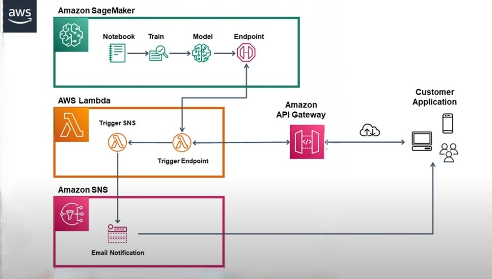
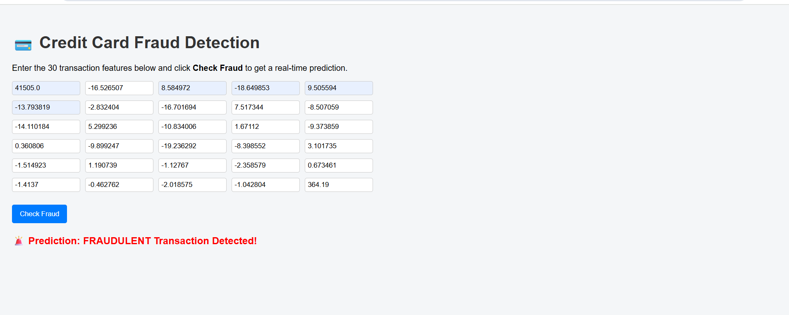
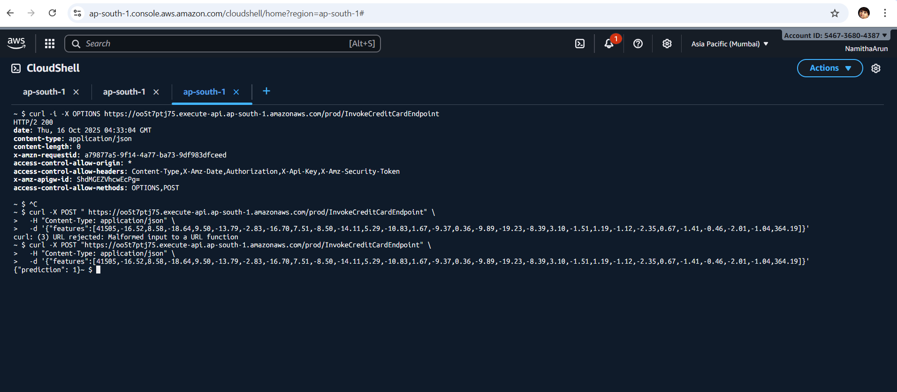
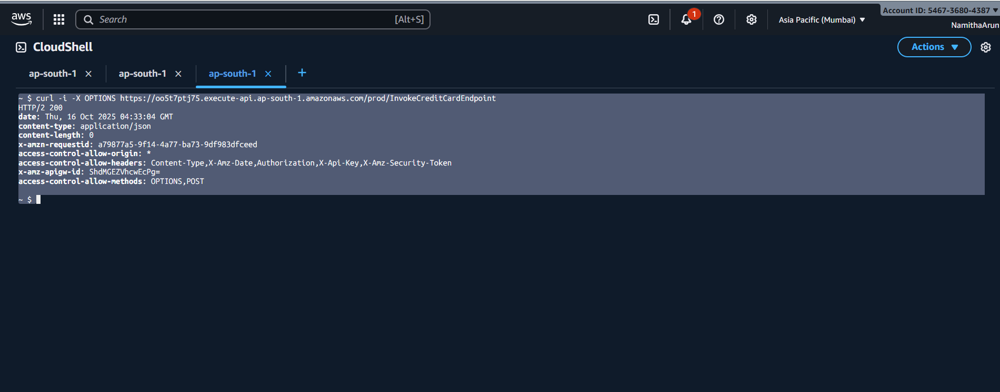
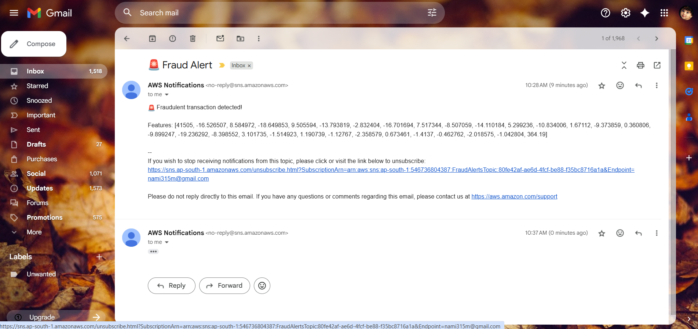

# 💳 Real-Time Credit Card Fraud Detection on AWS

This project implements a **real-time fraud detection use case** using AWS services.  
A simple **customer application (HTML UI)** interacts with **API Gateway**, **Lambda functions**, and a **SageMaker model** to detect fraudulent credit card transactions. If fraud is detected, an **SNS email notification** is sent automatically.

---

## 🧠 Use Case

- **Customer submits a transaction** through a web interface (index.html).  
- **API Gateway** receives the request and forwards it to **Lambda**.  
- **Lambda 1(SendFraudAlert)** invokes the **SageMaker endpoint** for fraud prediction.  
- If the result = `1` (fraud), **Lambda 2(InvokeCreditCardEndpoint)** publishes a message to **SNS** to send an **email alert** to the configured recipient.  
- The prediction result is returned to the customer application in real time.

---

## 🏗️ Architecture

Customer (HTML Form)
↓
Amazon API Gateway (REST API)
↓
Lambda (Invoke Endpoint)
↓
SageMaker Endpoint (Model)
↓
Lambda (Trigger SNS)
↓
Amazon SNS (Email Notification)  

## 📂 Project Structure  

credit-card-fraud-detection/  
│  
├─ data/  
│ └─ creditcard.csv # raw dataset  
│  
├─ notebooks/    
│ ├─ preprocessing.ipynb # Data preprocessing steps  
│ └─ training.ipynb # Model training & deployment  
│  
├─ scripts/  
│ ├─ preprocessing.py  
│ ├─ train_model.py  
│ ├─ inference.py  
│ └─ lambda_functions/  
│ ├─ InvokeCreditCardEndpoint.py # Lambda 1  
│ └─ SendFraudAlert.py # Lambda 2 (SNS trigger)  
│  
├─ frontend/  
│ └─ index.html # Customer UI to submit transactions  

Service	Purpose  

Amazon S3   	Store dataset, processed files, and trained model artifacts  
Amazon  SageMaker  	Preprocess, train, and deploy ML model as real-time endpoint  
AWS Lambda  	Backend logic for invoking model & triggering SNS  
Amazon API   Gateway  	Expose Lambda as REST API for frontend   
Amazon SNS  	Send email alerts for fraudulent transactions   
CloudWatch  	Log monitoring for Lambda and API calls 
AWS     CloudShell  	Used for running AWS CLI commands, uploading files to S3, testing SageMaker endpoints, and managing project resources directly from the browser  

  ## 🧪 Steps to Reproduce

### 1️⃣ **Data Upload**
- Download the dataset from Kaggle.  
- Upload `creditcard.csv` to your S3 bucket (`creditcard-pipeline-bucket/train/`).

### 2️⃣ **Data Preprocessing**
Run `notebooks/preprocessing.ipynb` or `scripts/preprocessing.py` to:
- Clean the dataset
- Split into train/test
- Upload `train.csv` and `test.csv` to `s3://creditcard-pipeline-bucket/processed/`

### 3️⃣ **Model Training**
- Use SageMaker notebook or `train_model.py` to train a model (e.g., XGBoost)
- The model is automatically stored in S3 after training

### 4️⃣ **Deploy Endpoint**
- Deploy the trained model as a real-time SageMaker endpoint.

### 5️⃣ **Lambda + API Gateway**
- Create a Lambda function (`InvokeCreditCardEndpoint.py`) to invoke the model.
- Expose Lambda through API Gateway.
- Enable CORS for your API endpoint.

### 6️⃣ **Frontend Testing**
- Open `frontend/index.html` in a browser.
- Enter transaction feature values (V1–V28, Amount, Time, etc.)
- Submit → You’ll see prediction output (`0` = non-fraud, `1` = fraud)

## 📸 Output & Testing Screenshots

Below are the results after testing the deployed **REST API** using the **frontend**, **AWS CloudShell**, and **API Gateway**.

### 🌐 Frontend Webpage (Customer UI)
The customer enters transaction details in the HTML form and gets an instant fraud prediction.

---

### 🧠 REST API Test via CloudShell
Using AWS CloudShell, we sent test transactions directly to the API Gateway endpoint using `curl` to verify backend responses.

---

### 🛠️ API Gateway Permissions / Testing
API Gateway console test to ensure **Lambda integration & permissions** are correctly set.

---

### 📩 SNS Email Alert
If the model predicts fraud (`1`), an **email notification** is triggered via Amazon SNS.

If the model predicts fraud (`1`), an **email notification** is triggered via Amazon SNS.

